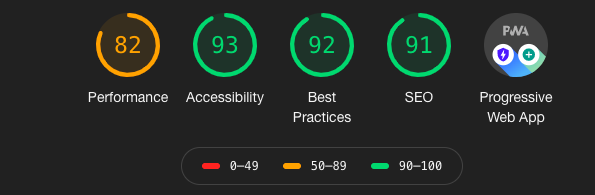

If you're not familiar with Gatsby, it's a React based framework which allows you to make blazing fast websites with a lot less legwork. 

## Why Gatsby was right for me

Firstly, I had heard so many amazing things when it came to creating a personal blog that I knew I had to give it a chance! Secondly, I had already created the first version of my portfolio site in React, so I knew there shouldn't be too much to change around.

The learning curve for Gatsby ended up being much smaller than I thought it would be. I was able to hack together the whole blogging section of my site using Gatsby's main tutorial, specifically Tutorial #4 on adding data, and [this post](https://www.thomas.wang/blog/developer-blog) by Thomas Wang. 

Some other great advantages to Gatsby aside from the amazing documentation, is the wonderful community supporting it. This is one of the reasons I really enjoy using React, great documentation and a great community behind it.

## Netlify CMS + Gatsby 

While these posts are written in Markdown, Netlify CMS allows you to write posts with a super simple UI and saves it as a Markdown file. The tool gives me the ability to quickly and easily write blog posts without needing to worry about syntax and deploying every upload.

My favorite features of Netlify CMS:

1. Simple UI

2. Writes to Markdown

3. Easy to add code blocks and photos

## Complications along the way

I ran into a few different issues along the way and features that I wanted to add in. For example: SEO, code block highlighting, getting photos to display properly. As I mentioned before I was able to rely on Thomas Wang's blog post, Gatsby documentation, and Google (of course).  

I initially wasted a lot of time trying to get Thomas's to work, then I thought about moving over to Next, and then was thinking to scrap it all and move over to Hashnode. The reason I decided not to use Wang's Gatsby Starter was that there was too much built in that I didn't want to be forced to use, this was actually a common theme with many starters. All in all, just using Gatsby's main tutorial and searching for the pieces you need on the Gatsby site are more than enough!

## What's next and what I learned 

My site and blog still have a lot of work to do, but I am so far very pleased with how it is turning out. I need to fix up a few issues with accessibility/speed even though the site is already lightning fast. I need to add a whole bunch more blog posts (of course)! There are some minor changes here and there I want to make to the post, maybe add in comments, navigation between posts, and estimated reading time.

My main takeaway is to just try something and stick to it! I am sure I could have saved myself and bunch of time and hassle if I just stuck to using Gatsby's documentation and implementing my own solution from the offset.

Also, checkout this awesome Lighthouse score, pretty amazing for V1. (Performance issues will be fixed once I add in code splitting I hope)

